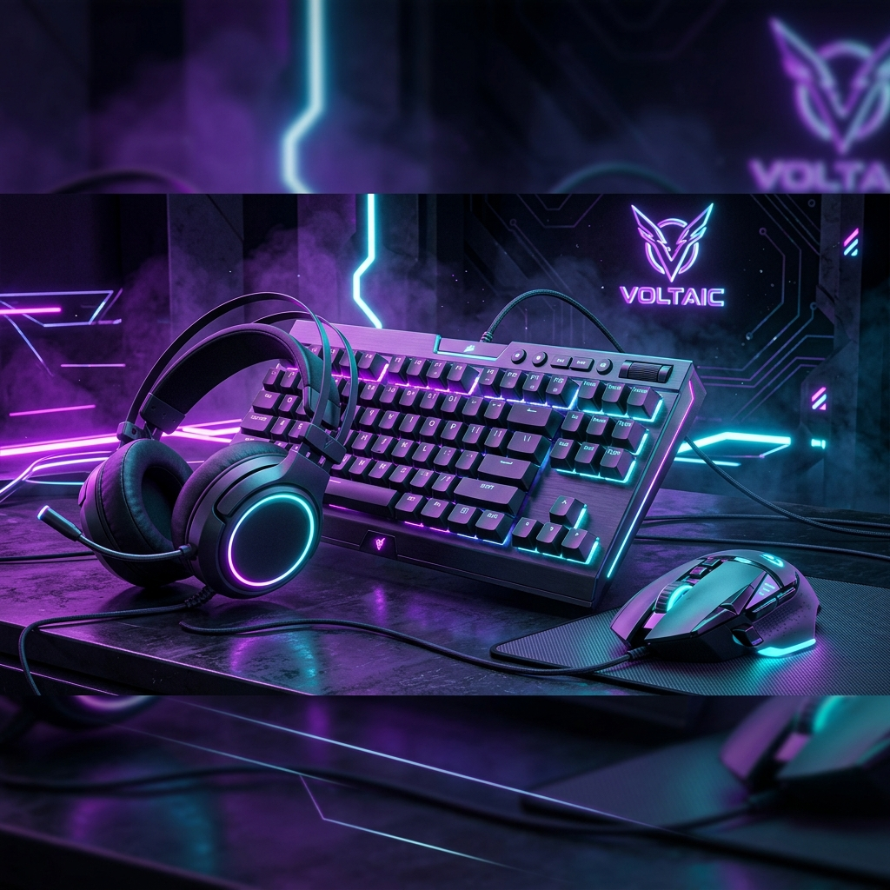

<div align="center">

# ⚡ NexGear — Gaming E-Commerce Platform

**O'zbekiston geymerlari uchun zamonaviy gaming aksessuarlar do'koni**

[](https://www.djangoproject.com/)
[](https://www.python.org/)
[](https://www.django-rest-framework.org/)
[](LICENSE)



</div>

---

## 📋 Loyiha haqida

**NexGear** — Razer uslubidagi qora va neon yashil ranglar asosida qurilgan zamonaviy gaming aksessuarlar e-commerce platformasi. Django backend va vanilla JS/CSS frontend bilan ishlab chiqilgan.

### ✨ Asosiy xususiyatlar

| Xususiyat | Tavsif |
|-----------|--------|
| 🛍️ **E-Commerce** | Mahsulot katalogi, savatcha, buyurtma tizimi |
| 🎨 **Razer UI** | Qora + neon yashil Razer-style dizayn |
| 🌙 **Dark/Light Mode** | LocalStorage-da saqlanadigan tema |
| 🦸 **Hero Bannerlar** | Admin orqali boshqariladigan slider bannerlar |
| 📦 **Manager Panel** | AJAX-driven mahsulot, kategoriya, buyurtma CRUD |
| 🔐 **Auth tizimi** | Ro'yxatdan o'tish, kirish, profil |
| 📱 **Responsive** | Barcha qurilmalarda ishlaydi |
| 🔍 **Qidiruv** | Real-time mahsulot qidirish |
| 🛒 **Savatcha badge** | Navbar da real-time savat soni |
| 🗂️ **Kategoriya dropdown** | DB dan to'ldirilgan mega-menu |

---

## 🛠️ Texnologiyalar

### Backend
- **Django 5.1.7** — asosiy framework
- **Django REST Framework 3.15** — API endpoints
- **SQLite** (dev) / **PostgreSQL** (prod)
- **Pillow** — rasm ishlash
- **Gunicorn** — production server
- **WhiteNoise** — statik fayllar

### Frontend
- **Vanilla CSS** — custom Razer-style dizayn tizimi
- **Vanilla JavaScript** — AJAX, animatsiyalar
- **Swiper.js** — hero banner slider
- **Google Fonts** — Orbitron + Inter

---

## 🏗️ Loyiha tuzilmasi

```
nexgear/
├── apps/
│   ├── accounts/       # Foydalanuvchi autentifikatsiyasi
│   ├── catalog/        # Mahsulotlar, kategoriyalar, brendlar, hero bannerlar
│   ├── orders/         # Buyurtmalar, savatcha
│   ├── manager/        # Admin manager panel
│   ├── reviews/        # Mahsulot sharhlari
│   ├── returns/        # Qaytarish tizimi
│   ├── suppliers/      # Ta'minotchilar
│   └── warehouse/      # Ombor boshqaruvi
├── ecommerce/          # Django loyiha sozlamalari
├── static/
│   ├── css/style.css   # Barcha UI stillari
│   └── js/app.js       # Frontend logika
├── templates/
│   ├── base.html       # Asosiy shablon (navbar, footer)
│   ├── home.html       # Bosh sahifa
│   ├── catalog/        # Mahsulot sahifalari
│   ├── manager/        # Admin panel shablonlari
│   └── orders/         # Savat va buyurtma sahifalari
├── media/              # Yuklangan rasmlar
├── requirements.txt
├── Dockerfile
└── docker-compose.yml
```

---

## 🚀 O'rnatish va ishga tushirish

### Talablar
- Python 3.12+
- pip

### 1. Klonlash

```bash
git clone https://github.com/dreamAka/e-commerce.git
cd e-commerce
```

### 2. Virtual muhit yaratish

```bash
python -m venv venv

# Windows
venv\Scripts\activate

# Linux / macOS
source venv/bin/activate
```

### 3. Dependensiyalarni o'rnatish

```bash
pip install -r requirements.txt
```

### 4. `.env` faylini sozlash

`.env` faylini yarating:

```env
SECRET_KEY=your-secret-key-here
DEBUG=True
ALLOWED_HOSTS=127.0.0.1,localhost
DATABASE_URL=sqlite:///db.sqlite3
```

### 5. Migratsiyalarni qo'llash

```bash
python manage.py migrate
```

### 6. Superuser yaratish

```bash
python manage.py createsuperuser
```

### 7. (Ixtiyoriy) Test ma'lumotlar yaratish

```bash
python manage.py generate_fake_data
```

### 8. Serverni ishga tushirish

```bash
python manage.py runserver
```

Brauzerda oching: **http://127.0.0.1:8000/**

---

## 🐳 Docker bilan ishga tushirish

```bash
docker-compose up --build
```

---

## 📄 Asosiy sahifalar

| URL | Tavsif |
|-----|--------|
| `/` | Bosh sahifa (Hero slider, kategoriyalar, mahsulotlar) |
| `/products/` | Mahsulotlar katalogi (filter, qidiruv, sort) |
| `/cart/` | Savatcha |
| `/orders/` | Buyurtmalar tarixi |
| `/accounts/login/` | Kirish |
| `/accounts/register/` | Ro'yxatdan o'tish |
| `/accounts/profile/` | Profil sahifasi |
| `/manager/` | Manager panel (faqat staff) |
| `/manager/products/` | Mahsulotlarni boshqarish |
| `/manager/storefront/` | Hero bannerlarni boshqarish |
| `/admin/` | Django admin panel |

---

## 🎛️ Manager Panel imkoniyatlari

Manager panelga kirish uchun `is_staff=True` bo'lishi kerak.

- **📦 Mahsulotlar** — qo'shish, tahrirlash, o'chirish, rasm yuklash
- **🗂️ Kategoriyalar** — CRUD boshqaruvi
- **📋 Buyurtmalar** — holat o'zgartirish, batafsil ko'rish
- **👥 Foydalanuvchilar** — ro'yxat va batafsil
- **🖼️ Storefront** — Hero bannerlar CRUD (rasm + rang + tartib)

---

## 🎨 Dizayn tizimi

```css
/* Asosiy ranglar */
--green:    #44d62c;   /* Razer neon yashil */
--bg-deep:  #0a0a0a;   /* Asosiy fon */
--bg-card:  #161616;   /* Karta foni */
--text:     #e8e8e8;   /* Asosiy matn */

/* Shriftlar */
--font-head: 'Orbitron', sans-serif;   /* Sarlavhalar */
--font-body: 'Inter', sans-serif;       /* Matn */
```

---

## 🖼️ Hero Banner uchun rasm tavsiyalari

| Tur | O'lcham | Format |
|-----|---------|--------|
| To'liq ekran | `1920 × 700 px` | JPG/WEBP |
| Mahsulot banner | `1280 × 600 px` | JPG/PNG |
| Minimal | `800 × 400 px` | WEBP |

> **Maslahat:** Qora/to'q fon rangli rasmlar matn bilan yaxshi ko'rinadi.

---

## 🤝 Hissa qo'shish

1. Fork qiling
2. Feature branch yarating: `git checkout -b feature/yangi-funksiya`
3. Commit qiling: `git commit -m 'feat: yangi funksiya qo'shildi'`
4. Push qiling: `git push origin feature/yangi-funksiya`
5. Pull Request oching

---

## 📝 Litsenziya

Bu loyiha [MIT License](LICENSE) ostida tarqatiladi.

---

<div align="center">

**⚡ NexGear** — O'zbekiston Gaming Community uchun

Ishlab chiqaruvchi: **dreamAka**

[](https://github.com/dreamAka/e-commerce)

</div>
